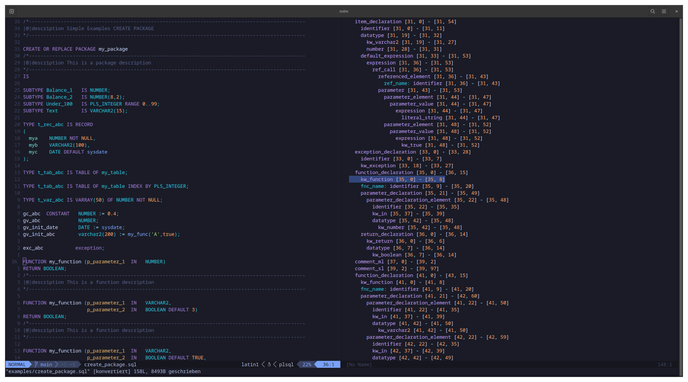

# tree-sitter-plsql
Oracle pl/sql grammar for tree-sitter

As oracle database developer you very often switch between pl/sql and sql elements. This grammar try to support the (most used) language elements from both worlds.
A few sqlplus commands will also be supported

# Status
It's in development and some (or many -> oracle syntax is huge) statements are missing or must optimized, but I use it at my daily job for syntax highlighting in neovim and it works in this files realy good.

This Oracle statements are at the moment supported:
- alter [package|function|procedure|library|type|trigger]
- create [package|function|procedure|library|type|type_body|trigger]
- drop [package|function|procedure|library|type|type_body|trigger]
- sql [select|update|delete|insert|merge]

# References
* [Database PL/SQL Language Reference](https://docs.oracle.com/en/database/oracle/oracle-database/21/lnpls/index.html)
* [SQL Language Reference](https://docs.oracle.com/en/database/oracle/oracle-database/21/lnpls/index.html)
